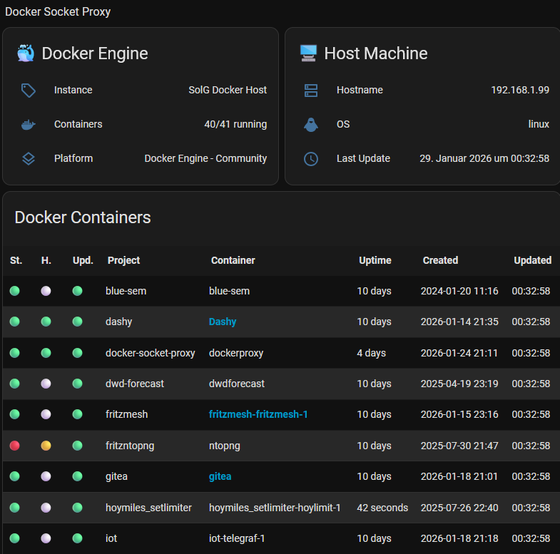

# HA Docker Socket Proxy


[](https://github.com/hacs/integration)


[](https://github.com/s-t-e-f-a-n/ha_docker_socket_proxy/actions/workflows/hacs.yml)

A Home Assistant integration that monitors Docker containers through a Docker socket proxy ([Tecnativa's docker-socket-proxy](https://github.com/Tecnativa/docker-socket-proxy)), providing real-time status, health checks, and service URLs for your containerized applications.

## Features

- **Real-time Monitoring**: Polls Docker Socket Proxy API every 30 seconds (configurable) for live container data
- **Auto-Discovery**: Automatically creates sensors for new containers as they're deployed
- **Health Checks**: Parses Docker health status from container status strings
- **Service URLs**: Generates web URLs from `ha.web_port` container labels
- **Multi-Host Support**: Monitor multiple Docker hosts with separate integrations
- **Grace Period Cleanup**: Configurable cleanup of orphaned container sensors
- **Rich Attributes**: Detailed metadata including ports, networks, uptime, and project info
- **Proactive Alerting**: Includes a built-in **Blueprint** for instant notifications (Mobile/Browser) when things go wrong.

### Example Table View on Your Docker Zoo :-)



...created from below comprehensive stacked vertical/horizontal flex-table-card example.

## Installation

### Via HACS (Recommended)

1. Ensure [HACS](https://hacs.xyz/) is installed in your Home Assistant instance
2. In HACS, go to **Integrations** → **+** → **Add Custom Repository**
3. Enter this repository URL: `https://github.com/s-t-e-f-a-n/ha_docker_socket_proxy`
4. Select **Integration** as the category
5. Click **Add** and then **Install**
6. Restart Home Assistant
7. Add the integration through **Settings** → **Devices & Services** → **+ Add Integration**

### Manual Installation

1. Download the `custom_components/docker_socket_proxy` folder from this repository
2. Copy it to your Home Assistant `custom_components` directory
3. Restart Home Assistant
4. Add the integration through the UI

## Configuration

### Basic Setup

1. In Home Assistant, go to **Settings** → **Devices & Services** → **+ Add Integration**
2. Search for "Docker Socket Proxy" and select it
3. Enter:
   - **Instance Name**: A friendly name for this Docker host (e.g., "NAS", "Server")
   - **Proxy URL**: The URL of your Docker socket proxy (e.g., `http://192.168.1.100:2375`)

### Configuration & Options

The integration can be fine-tuned after the initial setup. Go to **Settings** → **Devices & Services** → **Docker Socket Proxy** and click on **Configure**.

| Option | Description | Default |
| :--- | :--- | :--- |
| **Scan Interval** | How often (in seconds) the integration polls the Docker API. | `30` |
| **Enable Grace Period** | If enabled, sensors for vanished containers are not removed immediately. | `true` |
| **Grace Period** | The time (in seconds) to wait before an orphaned sensor is removed. | `604800` (1 week) |

> [!TIP]
> Changes to the options are applied immediately without requiring a restart of Home Assistant.

### Docker Socket Proxy Setup

This integration requires a Docker socket proxy for security. You can use [Tecnativa's docker-socket-proxy](https://github.com/Tecnativa/docker-socket-proxy):

```yaml
version: '3.8'
services:
  dockerproxy:
    image: tecnativa/docker-socket-proxy:latest
    container_name: docker-socket-proxy
    environment:
      - CONTAINERS=1
      - VERSION=1
    ports:
      - "2375:2375"
    volumes:
      - /var/run/docker.sock:/var/run/docker.sock:ro
    restart: unless-stopped
    healthcheck:
      test: wget --spider http://localhost:2375/version || exit 1
      interval: "29s"
      timeout: "5s"
      retries: 3
      start_period: "21s"
```

### Container Labels

Add labels to your containers for enhanced functionality:

```yaml
# Generate service URLs
labels:
  - "ha.web_port=8080:http"  # Single port
  - "ha.web_port=8080:http,8443:https"  # Multiple ports
  - "com.docker.compose.project=myproject"  # Project grouping
```

## Usage

The integration creates sensors for each Docker host and container:

### Host Sensor Attributes

The host status sensor provides a comprehensive overview of the Docker Engine and the underlying system environment.

| Attribute | Description |
| :--- | :--- |
| **InstanceName** | The friendly name assigned to this Docker host during setup. |
| **DockerHostname** | The actual hostname of the machine running Docker. |
| **Os** | The operating system of the host (e.g., `linux`). |
| **Arch** | The system architecture (e.g., `x86_64`, `arm64`). |
| **Kernel** | The specific kernel version of the host OS. |
| **PlatformName** | Information about the Docker platform. |
| **Version** | The installed Docker Engine version. |
| **ApiVersion** | The version of the Docker API the proxy is communicating with. |
| **last_update** | Timestamp of the last successful data poll from the proxy. |

---

#### Usage of Host Sensor Attributes in Dashboards

You can reference them in your `Entities` or `Template` cards like this:

```yaml
# Example: Displaying Host and Engine Version
- type: attribute
  entity: sensor.dockersocketproxy_your_host_status
  attribute: DockerHostname
  name: "Host Name"

- type: attribute
  entity: sensor.dockersocketproxy_your_host_status
  attribute: Version
  name: "Docker Version"
```

### Container Sensor Attributes

The integration extracts detailed information from Docker and provides the following attributes for each container sensor:

| Attribute | Description |
| :--- | :--- |
| **DisplayName** | The cleaned, friendly name for the UI. |
| **Names** | The raw Docker container names as a list. |
| **Image** | The Docker image used by the container. |
| **State** | The detailed container state string (e.g., `running`, `exited`). |
| **Uptime** | Human-readable uptime (e.g., `2 hours`). |
| **Health** | Docker health check status (`healthy`, `unhealthy`, `starting`, or `none`). |
| **UpdateAvailable** | Status indicating if a newer image version is available. |
| **Project** | Docker Compose project name (derived from labels). |
| **ServiceUrls** | List of clickable URLs generated from `ha.web_port` labels. |
| **Created** | ISO timestamp of the container creation. |
| **Ports** | List of active port mappings (e.g., `80:80/tcp`). |
| **NetworkSettings** | Detailed network object containing IP addresses and types. |
| **MacAddress** | The MAC address of the container. |
| **last_update** | Timestamp of the last successful data fetch from the proxy. |

---

#### Usage of Container Sensor Atributes in Dashboards

You can reference them in your `Entities` or `Template` cards like this:

```yaml
# Example: Displaying Container Health and Project
- type: attribute
  entity: sensor.dockersocketproxy_your_container
  attribute: Health
  name: "Health Status"

- type: attribute
  entity: sensor.dockersocketproxy_your_container
  attribute: Project
  name: "Compose Project"

# Example: Displaying Network and Uptime
- type: attribute
  entity: sensor.dockersocketproxy_your_container
  attribute: MacAddress
  name: "MAC Address"

- type: attribute
  entity: sensor.dockersocketproxy_your_container
  attribute: Uptime
  name: "Running Since"
```

## Dashboard Examples

### Simple Container Card

```yaml
type: entities
entities:
  - entity: sensor.dockersocketproxy_nas_host_status
  - entity: sensor.dockersocketproxy_nas_nginx
  - entity: sensor.dockersocketproxy_nas_postgres
title: Docker Containers
```

### Comprehensive Combined Vertical, Horizontal and Flex Table Card Example

For an extensive table view of all containers, use the [flex-table-card](https://github.com/custom-cards/flex-table-card):

```yaml
type: vertical-stack
cards:
  - type: conditional
    conditions:
      - entity: sensor.dockersocketproxy_my_docker_host_status
        state: unavailable version
    card:
      type: markdown
      content: "⚠️ TOTAL COMMUNICATION LOSS: VERSION API UNREACHABLE ⚠️"
  - type: conditional
    conditions:
      - entity: sensor.dockersocketproxy_my_docker_host_status
        state: unavailable containers
    card:
      type: markdown
      content: "⚠️ PARTIAL COMMUNICATION LOSS: CONTAINERS API UNREACHABLE ⚠️"
  - type: horizontal-stack
    cards:
      - type: entities
        title: 🐳 Docker Engine
        show_header_toggle: false
        entities:
          - type: attribute
            entity: sensor.dockersocketproxy_my_docker_host_status
            attribute: InstanceName
            name: Instance
            icon: mdi:tag-outline
          - entity: sensor.dockersocketproxy_my_docker_host_status
            name: Containers
            icon: mdi:docker
          - type: attribute
            entity: sensor.dockersocketproxy_my_docker_host_status
            attribute: PlatformName
            name: Platform
            icon: mdi:layers-outline
          - type: attribute
            entity: sensor.dockersocketproxy_my_docker_host_status
            attribute: Version
            name: Engine
            icon: mdi:engine-outline
          - type: attribute
            entity: sensor.dockersocketproxy_my_docker_host_status
            attribute: ApiVersion
            name: API
            icon: mdi:api
      - type: entities
        title: 🖥️ Host Machine
        show_header_toggle: false
        entities:
          - type: attribute
            entity: sensor.dockersocketproxy_my_docker_host_status
            attribute: DockerHostname
            name: Hostname
            icon: mdi:dns-outline
          - type: attribute
            entity: sensor.dockersocketproxy_my_docker_host_status
            attribute: Os
            name: OS
            icon: mdi:linux
          - type: attribute
            entity: sensor.dockersocketproxy_my_docker_host_status
            attribute: Arch
            name: Arch
            icon: mdi:cpu-64-bit
          - type: attribute
            entity: sensor.dockersocketproxy_my_docker_host_status
            attribute: Kernel
            name: Kernel
            icon: mdi:identifier
          - type: attribute
            entity: sensor.dockersocketproxy_my_docker_host_status
            attribute: last_update
            name: Last Update
            icon: mdi:clock-outline
  - type: custom:flex-table-card
    title: Docker Containers
    entities:
      include: sensor.dockersocketproxy_my_docker_*
      exclude: sensor.dockersocketproxy_my_docker_host_status
    strict: false
    css:
      table+: "width: 100%; border-collapse: collapse; table-layout: auto;"
      th+: >-
        white-space: nowrap; padding: 10px; text-align: left; background-color:
        rgba(0,0,0,0.1);
      td+: >-
        padding: 10px; vertical-align: middle; border-bottom: 1px solid
        rgba(127,127,127,0.1);
      td:nth-child(1), td:nth-child(2), td:nth-child(3): "width: 30px; text-align: center;"
    columns:
      - name: St.
        data: State
        modify: >-
          !x || ['unavailable', 'unknown', 'removed'].includes(x) ? '⚪' : (x ===
          'running' ? '🟢' : '🔴')
      - name: H.
        data: Health
        modify: >-
          !x || ['unavailable', 'unknown', 'n/a'].includes(x) ? '⚪' : (x ===
          'healthy' ? '🟢' : (x === 'unhealthy' ? '🔴' : '🟡'))
      - name: Upd.
        data: UpdateAvailable
        modify: >-
          !x || ['unavailable', 'unknown'].includes(x) ? '⚪' : (x === 'yes' ?
          '🔴' : '🟢')
      - name: Project
        data: Project
      - name: Container
        data: DisplayName
      - name: Image
        data: Image
      - name: IP (Network)
        data: NetworkSettings
      - name: MAC Address
        data: MacAddress
      - name: Ports
        data: Ports
      - name: Uptime
        data: Uptime
      - name: Created
        data: Created
      - name: Updated
        data: last_update
        modify: >-
          !x || ['unavailable', 'unknown'].includes(x) ? '-' : new
          Date(x).toLocaleTimeString('de-DE', {hour: '2-digit', minute:
          '2-digit', second: '2-digit'})
    sort_by: Project+
grid_options:
  columns: full
  rows: auto
```

This creates a sortable table showing container status with icons, health indicators, and port information.

#### Dashboard Impression

When your Docker stack is running normally, the dashboard provides a high-density overview of your infrastructure using the `horizontal-stack` and `flex-table-card`.

#### 🐳 Docker Engine & 🖥️ Host Machine

| Property | Docker Engine | Host Machine |
| :--- | :--- | :--- |
| **Instance / Host** | `Main Server` | `docker-prod-01` |
| **Containers / OS** | `14/15 running` | `Ubuntu 24.04 LTS` |
| **Platform / Arch** | `linux` | `x86_64` |
| **Engine / Kernel** | `27.1.0` | `6.8.0-1011-aws` |
| **API / Updated** | `1.46` | `14:35:02` |

#### Docker Containers (Live Status)

| St. | H. | Upd. | Project | Container | Image | IP (Network) | Uptime | Updated |
| :---: | :---: | :---: | :--- | :--- | :--- | :--- | :--- | :--- |
| 🟢 | 🟢 | 🟢 | `proxy` | **traefik** | `traefik:v3.1` | `172.20.0.2` | `3 weeks` | `14:35:02` |
| 🟢 | 🟢 | 🔴 | `home-automation` | **home-assistant** | `home-assistant:stable` | `172.20.0.5` | `4 days` | `14:35:02` |
| 🟢 | 🟡 | 🟢 | `databases` | **postgres-db** | `postgres:16-alpine` | `172.18.0.3` | `1 hour` | `14:34:58` |
| 🔴 | ⚪ | 🟢 | `monitoring` | **grafana** | `grafana/grafana:latest` | `-` | `-` | `14:34:45` |
| 🟢 | 🔴 | 🟢 | `media` | **plex-server** | `linuxserver/plex` | `172.20.0.15` | `12 hours` | `14:35:02` |

**Legend:**

- **St. (State):** 🟢 Running | 🔴 Stopped/Error | ⚪ Unavailable
- **H. (Health):** 🟢 Healthy | 🟡 Starting | 🔴 Unhealthy | ⚪ No Check

- **Upd. (Update):** 🔴 Update available | 🟢 Up to date

## Blueprints

This integration comes with a built-in blueprint to make monitoring even easier.

### Docker Proxy Health Alert

Automatically receive push notifications on your phone if:

- A container's health check turns **unhealthy**.
- The Docker host or proxy becomes **unavailable**.

**Actionable Notification:** The alert includes a "View Details" button that takes you directly to the Home Assistant devices page for quick troubleshooting.

#### How to use

1. Ensure the **Home Assistant Companion App** is installed on your phone.
2. Go to **Settings** → **Automations & Scenes** → **Blueprints**.
3. Locate **Docker Socket Proxy: Health Alert** and click **Create Automation**.

## Troubleshooting

### Common Issues

#### Failed to connect to Docker Proxy

- Verify the proxy URL is correct and accessible
- Check that the docker-socket-proxy container is running
- Ensure firewall allows connections to the proxy port

#### Missing containers

- Containers must be running for auto-discovery
- Check proxy logs for API access issues
- Verify CONTAINERS=1 environment variable in proxy

#### Sensors not updating

- Check Home Assistant logs for errors
- Verify network connectivity to proxy
- Restart the integration if needed

### Debug Logging

Enable debug logging in `configuration.yaml`:

```yaml
logger:
  logs:
    custom_components.docker_socket_proxy: debug
```

## Contributing

Contributions are welcome! Please:

1. Fork the repository
2. Create a feature branch
3. Make your changes
4. Test thoroughly
5. Submit a pull request

## License

This project is licensed under the Apache License, Version 2.0 - see the [LICENSE](LICENSE) file for details.

## Support

- [GitHub Issues](https://github.com/s-t-e-f-a-n/ha_docker_socket_proxy/issues) for bug reports and feature requests
- [Home Assistant Community](https://community.home-assistant.io) for general questions
